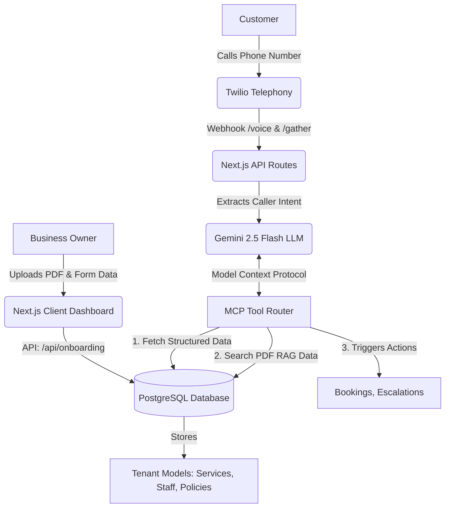

# 🎙️ Callify 

**Enterprise-Grade AI Voice Infrastructure for Local Businesses**

Callify is a B2B SaaS platform that allows local businesses (clinics, hotels, salons, etc.) to instantly deploy an intelligent, voice-first customer support agent. By simply filling out a form and uploading existing documents (PDFs/TXTs), businesses get a provisioned phone number where an AI instantly answers customer queries, books appointments, and checks prices—all based strictly on the business's unique data.

---

## 🚀 The Vision
Small and medium businesses miss calls and lose revenue because they cannot afford 24/7 human receptionists. Existing chatbot solutions are text-based and lack the personal, immediate touch of a phone call. Callify bridges this gap by providing an end-to-end AI telephony layer that feels native, conversational, and highly accurate.

## 🧠 System Architecture & Data Flow

Our architecture revolves around a "Structured-Data-First" knowledge layer combined with dynamic Agentic tools.



### The End-to-End Flow

1. **Onboarding (The Input):**
   - A business owner visits the Callify dashboard (`/onboarding` or `/test-upload`).
   - They provide structured data (Opening hours, Pricing, Contact info).
   - They upload unstructured data (PDFs of refund policies, complex FAQs).
   - *Result:* Callify saves this to the PostgreSQL Database and automatically links a provisioned Twilio Phone Number to this new "Tenant".

2. **The Call (The Interaction):**
   - A customer dials the Twilio number.
   - Twilio hits our `api/telephony/twilio/voice` endpoint, which greets the caller and begins a `<Gather>` loop.
   - The customer speaks: *"What time do you close on Sundays?"*

3. **The AI Brain (The Processing):**
   - Twilio transcribes the speech to text and sends it to our `api/telephony/twilio/gather` endpoint.
   - The system looks up the Tenant ID based on the phone number called.
   - We maintain a **Session Manager** to track the conversation history.
   - The prompt and history are sent to **Google Gemini 2.5 Flash**, operating as an active agent.

4. **MCP Tools & RAG (The Execution):**
   - If the LLM needs information it doesn't have, it calls an **MCP (Model Context Protocol) Tool**.
   - Example: It calls `search_knowledge`. Our system queries the PostgreSQL database for the PDF text chunks uploaded earlier, finds the answer, and returns it to the LLM.
   - The LLM synthesizes a final, human-friendly response.

5. **Response & TTS (The Output):**
   - The response is returned to Twilio via TwiML.
   - Twilio uses Text-to-Speech (TTS) to speak the answer back to the customer.
   - The conversation loop continues until the customer hangs up or a tool (like `escalate_to_human`) triggers a physical call transfer.

---

## 🛠️ Tech Stack Make-Up

- **Framework:** Next.js 14 (App Router)
- **Language:** TypeScript
- **Database:** PostgreSQL (hosted on Supabase)
- **ORM:** Prisma
- **AI Engine:** Google Gemini SDK (`gemini-2.5-flash`)
- **Telephony:** Twilio (Voice Webhooks & TwiML)
- **Deployment:** Vercel (Serverless Edge)

## ✨ Key Features & Highlights

- **Serverless Knowledge RAG:** We bypassed the need for expensive vector databases. When a PDF is uploaded, text is extracted and stored directly in standard PostgreSQL tables alongside the business logic, allowing instant, cost-effective retrieval on Vercel Edge.
- **Multi-Turn Session Memory:** Built a custom session manager that maps active Twilio `CallSids` to an array of conversation histories, ensuring the AI remembers what was said three turns ago.
- **Extensible Agentic Tools:** Built a custom MCP Router that allows the Gemini LLM to autonomously decide when to check the database for business hours, fetch pricing, book an appointment, or dial a real human.
- **Multi-Tenant Architecture:** A single codebase powers infinite businesses. The system uses the dialed phone number to dynamically swap the system prompt and database context to represent entirely different companies.

---

## 💻 Local Development Setup

1. **Clone & Install:**
   ```bash
   npm install
   ```

2. **Environment Variables:**
   Populate your `.env.local` with your database connection, Gemini API key, and Twilio configuration.
   *(Note: Ensure `TWILIO_PHONE_NUMBER` is set to your active Twilio number for the onboarding auto-link feature to work).*

3. **Database Migration:**
   ```bash
   npx prisma db push
   npx prisma generate
   ```

4. **Run Server & Ngrok:**
   ```bash
   npm run dev
   # In a separate terminal, expose the port:
   ngrok http 3000
   ```
   *Take your Ngrok HTTPS URL and set it in your Twilio Console under "A call comes in: Webhook".*

5. **Test the Flow:**
   Navigate to `http://localhost:3000/test-upload`, register a fake business, upload a PDF, and dial your Twilio number!
