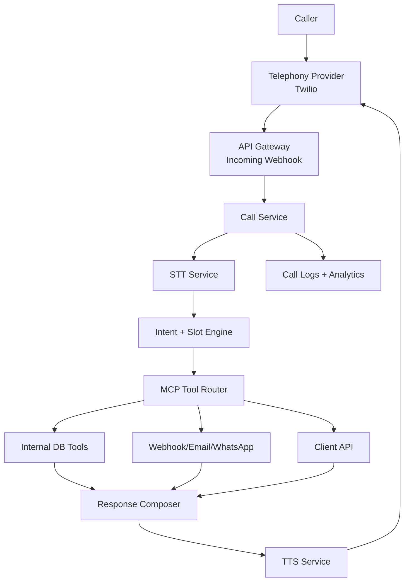

# VoiceDesk Architecture (Detailed)

## Execution Mode Update (March 2026)

This project will follow a **local-first development plan** with phased AI model strategy:

### Phase A — Local Development Only (Now)

- Build and test fully on laptop.
- Run frontend and backend locally.
- No AWS deployment required during this phase.
- Keep infra minimal so feature velocity is high.

### Phase B — External Free AI APIs (MVP)

- Use free-tier AI providers for intent detection/response orchestration in MVP.
- Recommended adapter-based integration so providers can be swapped without code rewrites.
- Provider examples (subject to plan limits): OpenRouter free routes, Groq free tier, Gemini free tier, Together free credits.
- Enforce strict deterministic tool execution (MCP) to reduce model dependency and hallucination risk.

### Phase C — Own AI Model (Final Stage)

- Replace external API calls with self-hosted model endpoint.
- Move to Ollama/self-hosted runtime when product flows are stable.
- Reuse same provider interface so switching is configuration-only at service boundary.
- AWS hosting becomes relevant in this stage (for scale, availability, and ops hardening).

### Engineering Rule for All Phases

- Implement an `AIProvider` abstraction (`classifyIntent`, `extractSlots`, `generatePromptedText`) and avoid direct provider SDK calls in business logic.
- Keep all model prompts/versioning in one place.
- Store provider selection in environment config so runtime can switch from `external_free` to `self_hosted` cleanly.

## 1) Product Definition

**VoiceDesk** is a B2B, multi-tenant, AI voice customer-care platform for SMBs.

It provides each business a phone number and handles customer calls in regional languages through a deterministic tool-driven backend.

### Core Principle

- Not a generic chatbot.
- It is a **voice interface for business operations**.
- LLM is used for intent classification and dialog orchestration; business truth comes from tools/data.

### Primary Users

- SMB owners/admins (restaurants, clinics, local ecommerce, repair shops, delivery businesses)
- Callers/customers of those businesses
- Platform operators/admins

---

## 2) Problem and Value

### SMB Pain Points

- Repetitive inbound calls (hours, pricing, order status, appointments)
- Missed calls during peak time
- No 24/7 support
- Costly human-only customer care
- No call analytics/insights

### VoiceDesk Value

- 24/7 automated call answering
- Regional language support (e.g., Gujarati, Hindi, English)
- Task completion (order status, appointment booking, ticket creation)
- Escalation to human when needed
- Business analytics and call intelligence

---

## 3) Tiered Product Model (All MCP-Based)

## Tier 1: Knowledge + Number

**Target:** Very small businesses

**Includes**

- Dedicated virtual number
- Knowledge base upload (FAQs/menu/hours/policies)
- AI voice answering from KB

**MCP Tool Set (minimal, internal)**

- `get_business_info()`
- `get_opening_hours()`
- `search_knowledge(query)`

**Data Source**

- Internal KB store only

---

## Tier 2: Communication Integrations

**Target:** SMBs needing notifications/follow-up

**Includes**

- Tier 1 features
- External communication actions

**MCP Tool Set (Tier 1 + comms)**

- `send_whatsapp(phone, message)`
- `send_email(to, subject, body)`
- `send_sms(phone, message)`
- `create_ticket(issue, customer_info)`
- `capture_lead(name, phone, intent)`

**Data Source**

- Internal KB + outbound channel providers

---

## Tier 3: Internal Business Dashboard (System of Record)

**Target:** SMBs that can use VoiceDesk dashboard as operational backend

**Includes**

- Tier 2 features
- Internal modules (appointments/orders/inventory/leads/tickets)

**MCP Tool Set (Tier 2 + internal ops)**

- `check_available_slots(date)`
- `book_appointment(name, date, time)`
- `cancel_appointment(appointment_id)`
- `get_order_status(order_id)`
- `check_inventory(product_name)`
- `create_support_ticket(issue)`

**Data Source**

- VoiceDesk internal PostgreSQL modules

---

## Tier 4: Full Custom Integration + Self-Hosted LLM

**Target:** Digitally mature SMBs / enterprise-like clients

**Includes**

- Tier 3 features
- Custom MCP tools mapped to client APIs/webhooks
- Self-hosted LLM on AWS via Ollama (no paid model dependency)

**MCP Tool Set**

- Dynamic/custom per tenant (allowlisted)
- Example: `cancel_order`, `refund_order`, `update_address`, `create_crm_ticket`

**Data Source**

- Client systems via API/webhook + optional internal fallback

---

## 4) End-to-End Call Lifecycle

1. Caller dials tenant number.
2. Telephony provider triggers incoming webhook.
3. System resolves tenant by dialed number.
4. Session created in Redis + call record initialized in PostgreSQL.
5. Audio stream processed (STT).
6. Intent detected from transcript.
7. Slot-filling checks required parameters.
8. If missing slots, ask follow-up question(s).
9. Once complete, execute MCP tool.
10. Convert structured result to deterministic response template.
11. Generate speech (TTS) and play to caller.
12. If confidence low / policy requires, escalate to human.
13. Persist call transcript, summary, metrics, and events.

### Call Flow Diagram



---

## 5) Core Runtime Components

## 5.1 Telephony Integration Service

**Responsibilities**

- Buy/assign/manage virtual numbers
- Receive inbound call webhooks
- Control call media stream and response playback
- Handle transfer/escalation to human number

**Key Inputs**

- `phone_number`, `caller_number`, provider metadata

**Key Outputs**

- Session start event
- Audio frames/utterance chunks

## 5.2 Speech Service

**Responsibilities**

- STT (Sarvam/Whisper/self-hosted)
- TTS (Sarvam/other)
- Language detection + normalization

**Non-functional goals**

- Low latency streaming
- Noise robust transcription

## 5.3 Intent + Slot Filling Engine

**Responsibilities**

- Intent classification from latest context + history
- Required parameter validation per tool schema
- Follow-up question generation for missing fields
- Confirmation step for critical operations

**Example intent contract**

```json
{
  "intent": "book_appointment",
  "confidence": 0.92,
  "required_slots": ["name", "date", "time"],
  "filled_slots": { "date": "Friday" },
  "next_action": "ask_slot"
}
```

## 5.4 MCP Tool Router

**Responsibilities**

- Resolve tool request by tenant + tier policy
- Fetch mapping config for action → connector
- Execute connector (internal-db/api/webhook/email/whatsapp)
- Return normalized tool result
- Enforce allowlist, timeouts, retries, circuit-breaking

**Normalized tool result**

```json
{
  "ok": true,
  "action": "get_order_status",
  "data": {
    "order_id": "123",
    "status": "shipped",
    "eta": "tomorrow"
  },
  "source": "client_api"
}
```

## 5.5 Dashboard API + Frontend

**Responsibilities**

- Tenant onboarding
- KB upload/management
- Integration configuration
- Number management
- Call logs, summaries, analytics, tickets, leads
- Subscription/billing status

## 5.6 Analytics Service

**Responsibilities**

- Aggregate call events
- Sentiment + trend analysis
- Top-intent and escalation metrics
- SLA and quality dashboards

---

## 6) Slot Filling and Intent Detection (Operational Design)

## Intent Detection

- Input: current utterance + conversation memory + tenant tool catalog
- Output: one intent from known tool action set + confidence score
- Rule: if confidence below threshold, ask clarifying question or route to fallback

## Slot Filling

- Every tool has a schema of required fields
- Engine tracks `filled_slots` in session state
- Missing slots are requested one-by-one
- Critical actions require explicit confirmation

### Example: Order Status

- User: “Where is my order?”
- Intent: `get_order_status`
- Missing: `order_id`
- Ask: “Please share your order number.”
- User: “123”
- Execute: `get_order_status(123)`

### Example: Appointment Booking

- User: “Book appointment Friday.”
- Intent: `book_appointment`
- Missing: `name`, `time`
- Ask sequence: time → name
- Confirm: “Confirm Friday 5 PM for Rahul?”
- Execute only after confirmation

---

## 7) Integration Strategy (Generic, Scalable)

Avoid writing custom logic per client. Implement a common action model.

## 7.1 Universal Action Catalog (initial)

- `get_order_status(order_id)`
- `check_available_slots(date)`
- `book_appointment(name, date, time)`
- `check_inventory(product_name)`
- `create_support_ticket(issue, customer)`
- `capture_lead(name, phone, interest)`
- `send_whatsapp(phone, message)`

## 7.2 Action Mapping Config (per tenant)

```json
{
  "tenant_id": "t_102",
  "action": "get_order_status",
  "connector_type": "api",
  "method": "GET",
  "endpoint": "https://client.example.com/orders/{order_id}",
  "auth": {
    "type": "bearer",
    "secret_ref": "secrets/client102/orders_api"
  },
  "request_mapping": {
    "order_id": "path.order_id"
  },
  "response_mapping": {
    "status": "data.status",
    "eta": "data.eta"
  },
  "timeout_ms": 3000,
  "retry": 2
}
```

## 7.3 Connector Types

- `internal_db`: execute against VoiceDesk internal tables
- `api`: direct REST API integration
- `webhook`: push event/data to client endpoint
- `email`: SMTP/provider adapter
- `whatsapp`: BSP adapter

---

## 8) Data Architecture

## Primary Stores

- PostgreSQL (tenant/config/calls/business data)
- Redis (conversation/session state, short-lived context)
- S3 (audio recordings, logs, exported reports)
- Optional vector store (KB retrieval)

## Core Tables (minimum)

### `tenants`

- `id`, `name`, `industry`, `default_language`, `tier`, `created_at`

### `users`

- `id`, `tenant_id`, `email`, `role`, `password_hash`, `created_at`

### `phone_numbers`

- `id`, `tenant_id`, `provider`, `number`, `status`, `created_at`

### `integrations`

- `id`, `tenant_id`, `action`, `connector_type`, `config_json`, `enabled`

### `calls`

- `id`, `tenant_id`, `caller_number`, `dialed_number`, `started_at`, `ended_at`, `status`, `escalated`

### `call_events`

- `id`, `call_id`, `event_type`, `payload_json`, `created_at`

### `sessions`

- `session_id`, `call_id`, `intent`, `filled_slots_json`, `state`, `updated_at`

### `tickets`

- `id`, `tenant_id`, `source_call_id`, `title`, `status`, `priority`

### `leads`

- `id`, `tenant_id`, `name`, `phone`, `interest`, `source_call_id`

### Tier-3 internal modules

- `appointments`, `orders`, `inventory_items`, `customers`

---

## 9) API Surface (Representative)

## Telephony Webhooks

- `POST /webhooks/incoming-call`
- `POST /webhooks/call-events`

## Conversation Runtime

- `POST /runtime/session/{id}/utterance`
- `POST /runtime/session/{id}/tool-result`

## Dashboard APIs

- `POST /api/tenants`
- `POST /api/knowledge/upload`
- `POST /api/integrations`
- `GET /api/calls`
- `GET /api/analytics/summary`
- `GET /api/tickets`
- `GET /api/leads`

## Billing APIs

- `POST /api/billing/checkout`
- `POST /api/billing/webhook`

---

## 10) AWS Deployment Blueprint

## 10.1 Compute and Networking

- API entry: AWS API Gateway
- Core services: ECS Fargate (or EKS for advanced ops)
- Service discovery: Cloud Map / internal ALB
- VPC: private subnets for app/data, public only for edge

## 10.2 Data and Queues

- PostgreSQL: Amazon RDS (Multi-AZ for production)
- Redis: ElastiCache
- Object storage: S3
- Async jobs: SQS + workers

## 10.3 Security and Secrets

- Secrets: AWS Secrets Manager
- KMS encryption at rest
- IAM least-privilege roles per service
- WAF + API Gateway throttling
- Signed webhook verification for provider callbacks

## 10.4 Observability

- Logs: CloudWatch + structured JSON logs
- Metrics: CloudWatch metrics + alarms
- Tracing: X-Ray / OpenTelemetry
- Alerting: SNS/Slack/Pager integration

## 10.5 LLM Hosting for Tier 4

- Ollama on EC2 GPU instance (e.g., g5 family)
- Private networking, no public model endpoint
- Model registry/versioning policy
- Warm pool or preloaded models for low cold-start latency

---

## 11) Scaling and Reliability

## Horizontal Scale

- Autoscale call-service by concurrent call/session count
- Autoscale STT/TTS workers by queue depth
- Separate read replicas for analytics-heavy workloads

## Latency Controls

- Streaming STT/TTS pipeline
- Response templates for common intents
- Redis cache for hot KB responses

## Resilience

- Connector timeout + fallback response
- Circuit breaker per external integration
- Idempotency keys for tool actions
- Graceful degrade to human transfer

---

## 12) Security, Compliance, and Guardrails

- Tenant data isolation (row-level or schema-level)
- RBAC in dashboard (`owner`, `admin`, `agent`, `viewer`)
- PII minimization and masked logs
- Recording/transcript retention policy by tenant
- Tool allowlist by tier and tenant policy
- No direct LLM free-form action execution without schema validation

---

## 13) Billing and Entitlements

## Example Plans

- Starter: ₹999 / month, 100 calls
- Growth: ₹2999 / month, 1000 calls
- Enterprise: custom

## Entitlement Gates

- Tier features enforced by middleware
- Per-plan limits: call minutes, integrations, seats, storage
- Overage handling and alerts

---

## 14) Recommended MVP Scope (Hackathon)

Build only these to show complete architecture:

- Inbound AI voice answering
- 3 intent flows:
  - `get_order_status`
  - `check_available_slots`
  - `book_appointment`
- Tiered integration proof:
  - Tier 1: KB answer
  - Tier 2: `send_whatsapp`
  - Tier 3: internal appointment table
  - Tier 4: one mock external API mapping
- Dashboard basics: call logs + analytics summary
- Confidence-based escalation to human

This scope is small enough to finish, but complete enough to look startup-grade.

---

## 15) Build Phases

## Phase A: Foundation

- Tenant, auth, number mapping, inbound webhook
- Session state + basic call loop

## Phase B: Intelligence Runtime

- Intent detection and slot filling engine
- MCP router + 2 connectors (`internal_db`, `webhook`)

## Phase C: Product Layer

- Dashboard + KB upload + integration config UI
- Analytics aggregation and summaries

## Phase D: Advanced

- Tier-4 custom tools
- Ollama self-hosted model on AWS
- Hardening (security, observability, retries)

---

## 16) Success Metrics

- AI resolution rate (% without human handoff)
- Escalation rate
- Average call handle time
- First-response latency
- Intent accuracy
- Slot completion rate
- Business retention by tier

---

## 17) Positioning Line

**“VoiceDesk is a tiered MCP-powered regional AI voice infrastructure platform that lets SMBs automate customer calls and business operations, from simple KB answering to full custom API automation.”**
